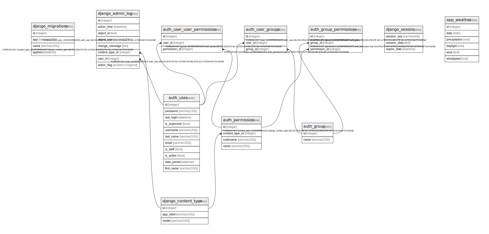

# db.sqlite3

## Tables

| Name | Columns | Comment | Type |
| ---- | ------- | ------- | ---- |
| [django_migrations](django_migrations.md) | 4 |  | table |
| [auth_group_permissions](auth_group_permissions.md) | 3 |  | table |
| [auth_user_groups](auth_user_groups.md) | 3 |  | table |
| [auth_user_user_permissions](auth_user_user_permissions.md) | 3 |  | table |
| [django_admin_log](django_admin_log.md) | 8 |  | table |
| [django_content_type](django_content_type.md) | 3 |  | table |
| [auth_permission](auth_permission.md) | 4 |  | table |
| [auth_group](auth_group.md) | 2 |  | table |
| [auth_user](auth_user.md) | 11 |  | table |
| [django_session](django_session.md) | 3 |  | table |
| [app_weather](app_weather.md) | 6 |  | table |

## Relations

---

> Generated by [tbls](https://github.com/k1LoW/tbls)
