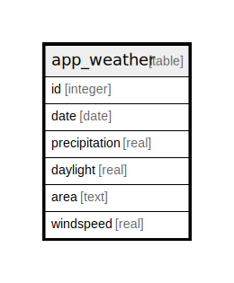

# app_weather

## Description

<details>
<summary><strong>Table Definition</strong></summary>

```sql
CREATE TABLE "app_weather" ("id" integer NOT NULL PRIMARY KEY AUTOINCREMENT, "date" date NULL, "precipitation" real NULL, "daylight" real NULL, "area" text NULL, "windspeed" real NULL)
```

</details>

## Columns

| Name | Type | Default | Nullable | Children | Parents | Comment |
| ---- | ---- | ------- | -------- | -------- | ------- | ------- |
| id | integer |  | false |  |  |  |
| date | date |  | true |  |  |  |
| precipitation | real |  | true |  |  |  |
| daylight | real |  | true |  |  |  |
| area | text |  | true |  |  |  |
| windspeed | real |  | true |  |  |  |

## Constraints

| Name | Type | Definition |
| ---- | ---- | ---------- |
| id | PRIMARY KEY | PRIMARY KEY (id) |

## Relations



---

> Generated by [tbls](https://github.com/k1LoW/tbls)
