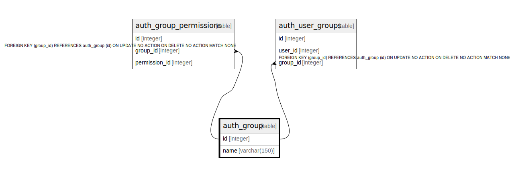

# auth_group

## Description

<details>
<summary><strong>Table Definition</strong></summary>

```sql
CREATE TABLE "auth_group" ("id" integer NOT NULL PRIMARY KEY AUTOINCREMENT, "name" varchar(150) NOT NULL UNIQUE)
```

</details>

## Columns

| Name | Type | Default | Nullable | Children | Parents | Comment |
| ---- | ---- | ------- | -------- | -------- | ------- | ------- |
| id | integer |  | false | [auth_group_permissions](auth_group_permissions.md) [auth_user_groups](auth_user_groups.md) |  |  |
| name | varchar(150) |  | false |  |  |  |

## Constraints

| Name | Type | Definition |
| ---- | ---- | ---------- |
| id | PRIMARY KEY | PRIMARY KEY (id) |
| sqlite_autoindex_auth_group_1 | UNIQUE | UNIQUE (name) |

## Indexes

| Name | Definition |
| ---- | ---------- |
| sqlite_autoindex_auth_group_1 | UNIQUE (name) |

## Relations



---

> Generated by [tbls](https://github.com/k1LoW/tbls)
