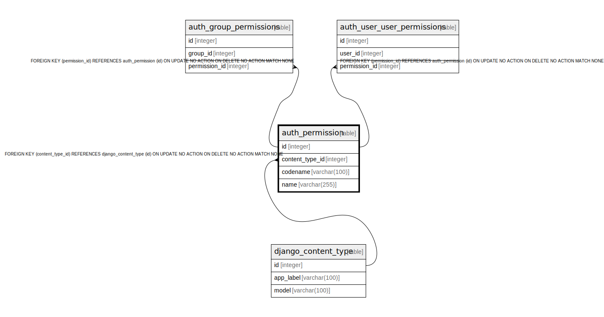

# auth_permission

## Description

<details>
<summary><strong>Table Definition</strong></summary>

```sql
CREATE TABLE "auth_permission" ("id" integer NOT NULL PRIMARY KEY AUTOINCREMENT, "content_type_id" integer NOT NULL REFERENCES "django_content_type" ("id") DEFERRABLE INITIALLY DEFERRED, "codename" varchar(100) NOT NULL, "name" varchar(255) NOT NULL)
```

</details>

## Columns

| Name | Type | Default | Nullable | Children | Parents | Comment |
| ---- | ---- | ------- | -------- | -------- | ------- | ------- |
| id | integer |  | false | [auth_group_permissions](auth_group_permissions.md) [auth_user_user_permissions](auth_user_user_permissions.md) |  |  |
| content_type_id | integer |  | false |  | [django_content_type](django_content_type.md) |  |
| codename | varchar(100) |  | false |  |  |  |
| name | varchar(255) |  | false |  |  |  |

## Constraints

| Name | Type | Definition |
| ---- | ---- | ---------- |
| id | PRIMARY KEY | PRIMARY KEY (id) |
| - (Foreign key ID: 0) | FOREIGN KEY | FOREIGN KEY (content_type_id) REFERENCES django_content_type (id) ON UPDATE NO ACTION ON DELETE NO ACTION MATCH NONE |

## Indexes

| Name | Definition |
| ---- | ---------- |
| auth_permission_content_type_id_2f476e4b | CREATE INDEX "auth_permission_content_type_id_2f476e4b" ON "auth_permission" ("content_type_id") |
| auth_permission_content_type_id_codename_01ab375a_uniq | CREATE UNIQUE INDEX "auth_permission_content_type_id_codename_01ab375a_uniq" ON "auth_permission" ("content_type_id", "codename") |

## Relations



---

> Generated by [tbls](https://github.com/k1LoW/tbls)
