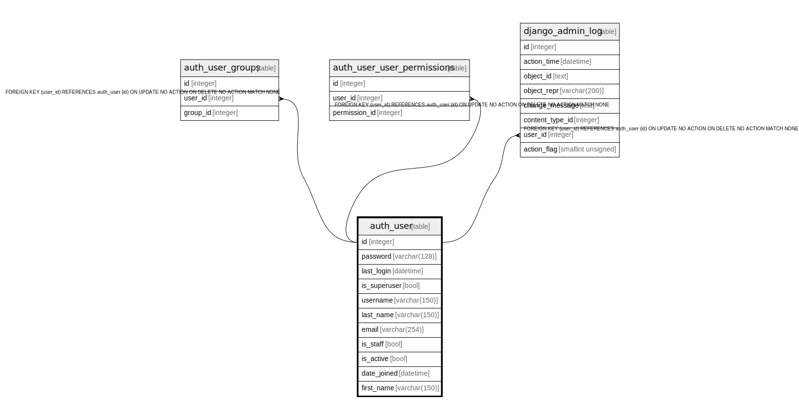

# auth_user

## Description

<details>
<summary><strong>Table Definition</strong></summary>

```sql
CREATE TABLE "auth_user" ("id" integer NOT NULL PRIMARY KEY AUTOINCREMENT, "password" varchar(128) NOT NULL, "last_login" datetime NULL, "is_superuser" bool NOT NULL, "username" varchar(150) NOT NULL UNIQUE, "last_name" varchar(150) NOT NULL, "email" varchar(254) NOT NULL, "is_staff" bool NOT NULL, "is_active" bool NOT NULL, "date_joined" datetime NOT NULL, "first_name" varchar(150) NOT NULL)
```

</details>

## Columns

| Name | Type | Default | Nullable | Children | Parents | Comment |
| ---- | ---- | ------- | -------- | -------- | ------- | ------- |
| id | integer |  | false | [auth_user_groups](auth_user_groups.md) [auth_user_user_permissions](auth_user_user_permissions.md) [django_admin_log](django_admin_log.md) |  |  |
| password | varchar(128) |  | false |  |  |  |
| last_login | datetime |  | true |  |  |  |
| is_superuser | bool |  | false |  |  |  |
| username | varchar(150) |  | false |  |  |  |
| last_name | varchar(150) |  | false |  |  |  |
| email | varchar(254) |  | false |  |  |  |
| is_staff | bool |  | false |  |  |  |
| is_active | bool |  | false |  |  |  |
| date_joined | datetime |  | false |  |  |  |
| first_name | varchar(150) |  | false |  |  |  |

## Constraints

| Name | Type | Definition |
| ---- | ---- | ---------- |
| id | PRIMARY KEY | PRIMARY KEY (id) |
| sqlite_autoindex_auth_user_1 | UNIQUE | UNIQUE (username) |

## Indexes

| Name | Definition |
| ---- | ---------- |
| sqlite_autoindex_auth_user_1 | UNIQUE (username) |

## Relations



---

> Generated by [tbls](https://github.com/k1LoW/tbls)
