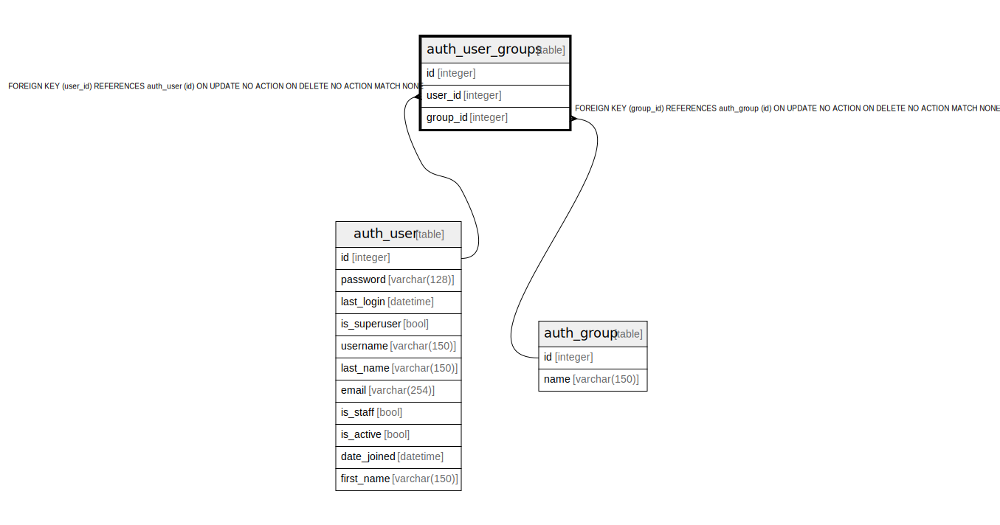

# auth_user_groups

## Description

<details>
<summary><strong>Table Definition</strong></summary>

```sql
CREATE TABLE "auth_user_groups" ("id" integer NOT NULL PRIMARY KEY AUTOINCREMENT, "user_id" integer NOT NULL REFERENCES "auth_user" ("id") DEFERRABLE INITIALLY DEFERRED, "group_id" integer NOT NULL REFERENCES "auth_group" ("id") DEFERRABLE INITIALLY DEFERRED)
```

</details>

## Columns

| Name | Type | Default | Nullable | Children | Parents | Comment |
| ---- | ---- | ------- | -------- | -------- | ------- | ------- |
| id | integer |  | false |  |  |  |
| user_id | integer |  | false |  | [auth_user](auth_user.md) |  |
| group_id | integer |  | false |  | [auth_group](auth_group.md) |  |

## Constraints

| Name | Type | Definition |
| ---- | ---- | ---------- |
| id | PRIMARY KEY | PRIMARY KEY (id) |
| - (Foreign key ID: 0) | FOREIGN KEY | FOREIGN KEY (group_id) REFERENCES auth_group (id) ON UPDATE NO ACTION ON DELETE NO ACTION MATCH NONE |
| - (Foreign key ID: 1) | FOREIGN KEY | FOREIGN KEY (user_id) REFERENCES auth_user (id) ON UPDATE NO ACTION ON DELETE NO ACTION MATCH NONE |

## Indexes

| Name | Definition |
| ---- | ---------- |
| auth_user_groups_group_id_97559544 | CREATE INDEX "auth_user_groups_group_id_97559544" ON "auth_user_groups" ("group_id") |
| auth_user_groups_user_id_6a12ed8b | CREATE INDEX "auth_user_groups_user_id_6a12ed8b" ON "auth_user_groups" ("user_id") |
| auth_user_groups_user_id_group_id_94350c0c_uniq | CREATE UNIQUE INDEX "auth_user_groups_user_id_group_id_94350c0c_uniq" ON "auth_user_groups" ("user_id", "group_id") |

## Relations



---

> Generated by [tbls](https://github.com/k1LoW/tbls)
