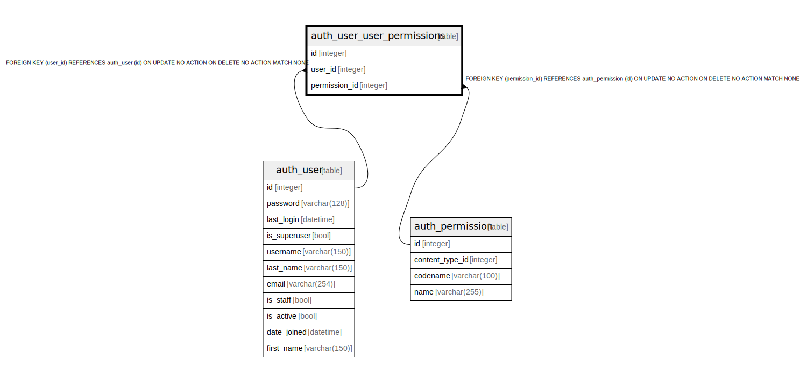

# auth_user_user_permissions

## Description

<details>
<summary><strong>Table Definition</strong></summary>

```sql
CREATE TABLE "auth_user_user_permissions" ("id" integer NOT NULL PRIMARY KEY AUTOINCREMENT, "user_id" integer NOT NULL REFERENCES "auth_user" ("id") DEFERRABLE INITIALLY DEFERRED, "permission_id" integer NOT NULL REFERENCES "auth_permission" ("id") DEFERRABLE INITIALLY DEFERRED)
```

</details>

## Columns

| Name | Type | Default | Nullable | Children | Parents | Comment |
| ---- | ---- | ------- | -------- | -------- | ------- | ------- |
| id | integer |  | false |  |  |  |
| user_id | integer |  | false |  | [auth_user](auth_user.md) |  |
| permission_id | integer |  | false |  | [auth_permission](auth_permission.md) |  |

## Constraints

| Name | Type | Definition |
| ---- | ---- | ---------- |
| id | PRIMARY KEY | PRIMARY KEY (id) |
| - (Foreign key ID: 0) | FOREIGN KEY | FOREIGN KEY (permission_id) REFERENCES auth_permission (id) ON UPDATE NO ACTION ON DELETE NO ACTION MATCH NONE |
| - (Foreign key ID: 1) | FOREIGN KEY | FOREIGN KEY (user_id) REFERENCES auth_user (id) ON UPDATE NO ACTION ON DELETE NO ACTION MATCH NONE |

## Indexes

| Name | Definition |
| ---- | ---------- |
| auth_user_user_permissions_permission_id_1fbb5f2c | CREATE INDEX "auth_user_user_permissions_permission_id_1fbb5f2c" ON "auth_user_user_permissions" ("permission_id") |
| auth_user_user_permissions_user_id_a95ead1b | CREATE INDEX "auth_user_user_permissions_user_id_a95ead1b" ON "auth_user_user_permissions" ("user_id") |
| auth_user_user_permissions_user_id_permission_id_14a6b632_uniq | CREATE UNIQUE INDEX "auth_user_user_permissions_user_id_permission_id_14a6b632_uniq" ON "auth_user_user_permissions" ("user_id", "permission_id") |

## Relations



---

> Generated by [tbls](https://github.com/k1LoW/tbls)
