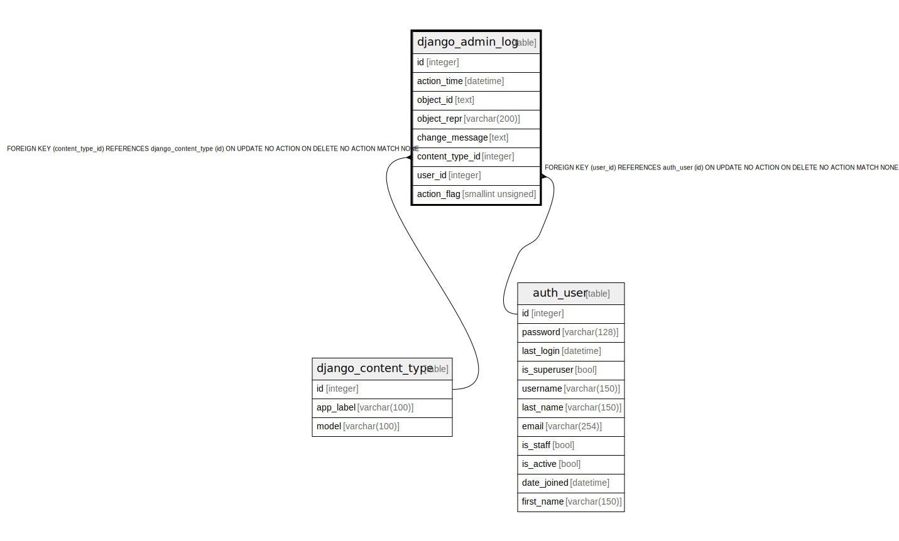

# django_admin_log

## Description

<details>
<summary><strong>Table Definition</strong></summary>

```sql
CREATE TABLE "django_admin_log" ("id" integer NOT NULL PRIMARY KEY AUTOINCREMENT, "action_time" datetime NOT NULL, "object_id" text NULL, "object_repr" varchar(200) NOT NULL, "change_message" text NOT NULL, "content_type_id" integer NULL REFERENCES "django_content_type" ("id") DEFERRABLE INITIALLY DEFERRED, "user_id" integer NOT NULL REFERENCES "auth_user" ("id") DEFERRABLE INITIALLY DEFERRED, "action_flag" smallint unsigned NOT NULL CHECK ("action_flag" >= 0))
```

</details>

## Columns

| Name | Type | Default | Nullable | Children | Parents | Comment |
| ---- | ---- | ------- | -------- | -------- | ------- | ------- |
| id | integer |  | false |  |  |  |
| action_time | datetime |  | false |  |  |  |
| object_id | text |  | true |  |  |  |
| object_repr | varchar(200) |  | false |  |  |  |
| change_message | text |  | false |  |  |  |
| content_type_id | integer |  | true |  | [django_content_type](django_content_type.md) |  |
| user_id | integer |  | false |  | [auth_user](auth_user.md) |  |
| action_flag | smallint unsigned |  | false |  |  |  |

## Constraints

| Name | Type | Definition |
| ---- | ---- | ---------- |
| id | PRIMARY KEY | PRIMARY KEY (id) |
| - (Foreign key ID: 0) | FOREIGN KEY | FOREIGN KEY (user_id) REFERENCES auth_user (id) ON UPDATE NO ACTION ON DELETE NO ACTION MATCH NONE |
| - (Foreign key ID: 1) | FOREIGN KEY | FOREIGN KEY (content_type_id) REFERENCES django_content_type (id) ON UPDATE NO ACTION ON DELETE NO ACTION MATCH NONE |
| - | CHECK | CHECK ("action_flag" >= 0) |

## Indexes

| Name | Definition |
| ---- | ---------- |
| django_admin_log_user_id_c564eba6 | CREATE INDEX "django_admin_log_user_id_c564eba6" ON "django_admin_log" ("user_id") |
| django_admin_log_content_type_id_c4bce8eb | CREATE INDEX "django_admin_log_content_type_id_c4bce8eb" ON "django_admin_log" ("content_type_id") |

## Relations



---

> Generated by [tbls](https://github.com/k1LoW/tbls)
