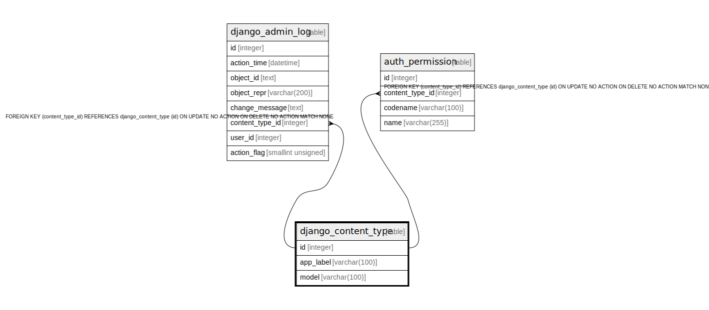

# django_content_type

## Description

<details>
<summary><strong>Table Definition</strong></summary>

```sql
CREATE TABLE "django_content_type" ("id" integer NOT NULL PRIMARY KEY AUTOINCREMENT, "app_label" varchar(100) NOT NULL, "model" varchar(100) NOT NULL)
```

</details>

## Columns

| Name | Type | Default | Nullable | Children | Parents | Comment |
| ---- | ---- | ------- | -------- | -------- | ------- | ------- |
| id | integer |  | false | [django_admin_log](django_admin_log.md) [auth_permission](auth_permission.md) |  |  |
| app_label | varchar(100) |  | false |  |  |  |
| model | varchar(100) |  | false |  |  |  |

## Constraints

| Name | Type | Definition |
| ---- | ---- | ---------- |
| id | PRIMARY KEY | PRIMARY KEY (id) |

## Indexes

| Name | Definition |
| ---- | ---------- |
| django_content_type_app_label_model_76bd3d3b_uniq | CREATE UNIQUE INDEX "django_content_type_app_label_model_76bd3d3b_uniq" ON "django_content_type" ("app_label", "model") |

## Relations



---

> Generated by [tbls](https://github.com/k1LoW/tbls)
