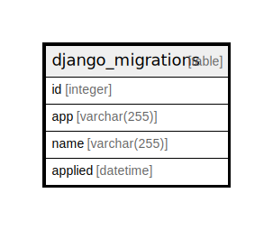

# django_migrations

## Description

<details>
<summary><strong>Table Definition</strong></summary>

```sql
CREATE TABLE "django_migrations" ("id" integer NOT NULL PRIMARY KEY AUTOINCREMENT, "app" varchar(255) NOT NULL, "name" varchar(255) NOT NULL, "applied" datetime NOT NULL)
```

</details>

## Columns

| Name | Type | Default | Nullable | Children | Parents | Comment |
| ---- | ---- | ------- | -------- | -------- | ------- | ------- |
| id | integer |  | false |  |  |  |
| app | varchar(255) |  | false |  |  |  |
| name | varchar(255) |  | false |  |  |  |
| applied | datetime |  | false |  |  |  |

## Constraints

| Name | Type | Definition |
| ---- | ---- | ---------- |
| id | PRIMARY KEY | PRIMARY KEY (id) |

## Relations



---

> Generated by [tbls](https://github.com/k1LoW/tbls)
