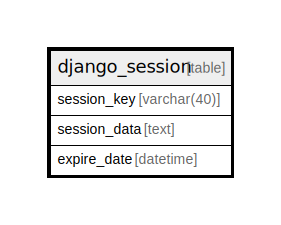

# django_session

## Description

<details>
<summary><strong>Table Definition</strong></summary>

```sql
CREATE TABLE "django_session" ("session_key" varchar(40) NOT NULL PRIMARY KEY, "session_data" text NOT NULL, "expire_date" datetime NOT NULL)
```

</details>

## Columns

| Name | Type | Default | Nullable | Children | Parents | Comment |
| ---- | ---- | ------- | -------- | -------- | ------- | ------- |
| session_key | varchar(40) |  | false |  |  |  |
| session_data | text |  | false |  |  |  |
| expire_date | datetime |  | false |  |  |  |

## Constraints

| Name | Type | Definition |
| ---- | ---- | ---------- |
| session_key | PRIMARY KEY | PRIMARY KEY (session_key) |
| sqlite_autoindex_django_session_1 | PRIMARY KEY | PRIMARY KEY (session_key) |

## Indexes

| Name | Definition |
| ---- | ---------- |
| django_session_expire_date_a5c62663 | CREATE INDEX "django_session_expire_date_a5c62663" ON "django_session" ("expire_date") |
| sqlite_autoindex_django_session_1 | PRIMARY KEY (session_key) |

## Relations



---

> Generated by [tbls](https://github.com/k1LoW/tbls)
